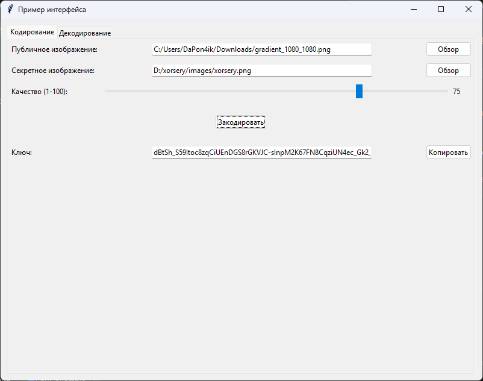
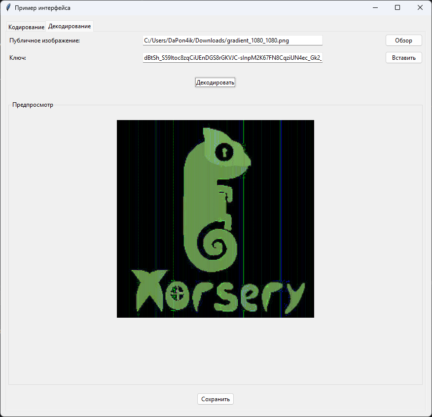
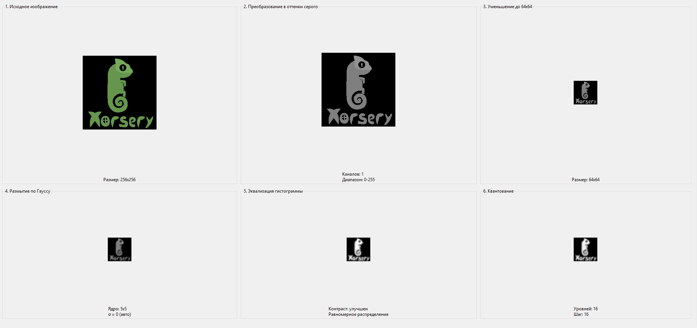

<div align="center">


# Xorsery 🦎


[](LICENSE)


##### Xorsery — инструмент для сокрытия изображений с использованием XOR и AES-CTR шифрования.

</div>

## Принцип работы:
- Публичное и секретное изображения приводятся к одному размеру
- Вычисляется XOR разница между ними
- Полученный шум шифруется AES-CTR с ключом, производным от публичного изображения (SHA256)
- Результат возвращается в виде base64 строки

Для восстановления требуются оригинальное публичное изображение и ключ.




---

## Использование

### Способ 1 — как библиотека:

```
from algorithm import encode, decode

key = encode("public.jpg", "secret.jpg", quality=50)
decode("public.jpg", key, output_path="restored.png")

```

### Способ 2 — через графический интерфейс:

Использовать пример gui-обёртки или сделать свою.

---

## API

encode(public_path, secret_path, quality=50)
- quality (1-100) — влияет на размер ключа и степень сжатия
- Возвращает: base64 ключ

decode(public_path, key, output_path=None)
- Возвращает: numpy array или путь к файлу

---

### Нормализация

Важной особенностью алгоритма является то, что ключ шифрования генерируется из пикселей публичного изображения. Однако на практике пользователь может не скачать оригинал, а сделать скриншот или сохранить картинку с потерей качества (JPEG). Это приводит к изменению значений пикселей и, как следствие, к генерации другого ключа, что делает расшифровку невозможной. На этапе кодирования нормализация нужна только чтобы зашить в ключ именно тот самый нужный отпечаток, который понадобится на декодировании, если изображение будет не точь-в-точь оригинал.

Чтобы решить эту проблему на этапе декодирования, изображение проходит процесс нормализации, состоящий из 5 этапов:



1. **Оттенки серого:** Убирает цветовую информацию.
2. **Ресайз до 64x64:** Отбрасывает мелкие детали (шум и мусор), оставляя только глобальную структуру картинки.
3. **Размытие по Гауссу 3x3 (или как было раньше 5x5):** Подавляет характерные для JPEG-сжатия "звонкие" артефакты на резких границах.
4. **Эквализация гистограммы:** Выравнивает контраст, делая алгоритм устойчивым к изменению яркости, которое возникает при создании скриншота.
5. **Квантование (округление до кратного 4, раньше был шаг 16 что давало 16 уровней, но теперь шаг 4 и 64 уровня):** Создает "защитный буфер". Если пиксель изменился на 1–3 единицы из-за сжатия, после квантования его значение попадет в ту же группу, что и у оригинала, сохраняя ключ идентичным.

Благодаря этому процессу, пользователь может использовать скриншот или сжатую версию публичного изображения, и алгоритм всё равно сгенерирует правильный ключ для расшифровки.

---

## Важно

- Из-за JPEG-сжатия восстановленное изображение теряет качество
- Для сохранения результата рекомендуется использовать PNG
- Для расшифровки требуется публичное изображение идентичное тому, которое использовалось при кодировании. Это не обязательно должен быть тот же файл, но изображение должно быть точно таким же.

---

## От себя

Я специально не стал делать кучу проверок if/else, которые можно просто вырезать из кода. Вместо этого я завязал расшифровку на саму картинку: ключ считается из неё, и если картинка левая или проверки сломаны — ключ получается неправильный, и секрет никак не достать. Отдельная проверка файлов спрятана так, что без неё внутрь попадёт каша из байтов, и код всё равно упадёт. Короче, просто удалить условия и обойти защиту не выйдет — всё развалится само.


А ещё можно было алгоритм развернуть в обратную сторону: вычесть ключ из секретных картинок и получить кучу публичных, которые расшифровываются одним и тем же ключом.